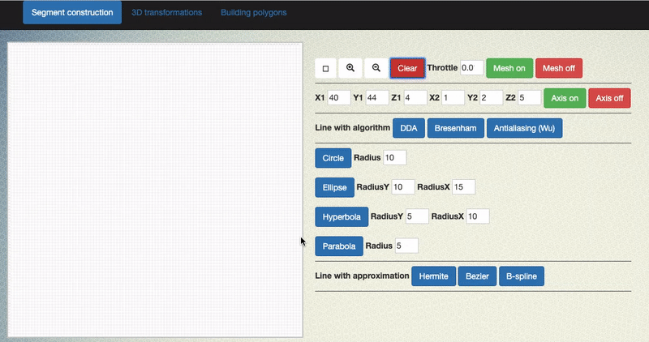
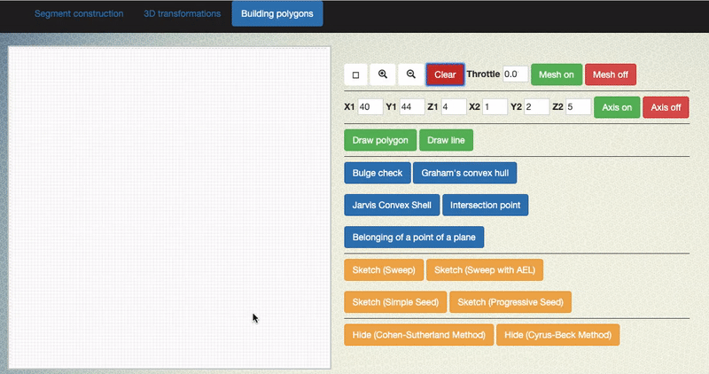

# Computer graphics algorithms

## Segment construction algorithms
   
1. Digital Differential Analyzer
2. Bresenham algorithm
3. Algorithm of eliminating aliasing

## Algorithms for constructing second-order lines

1. Bresenham algorithm for generating a circle
2. Ellipse generation algorithm
3. Hyperbola generation algorithm
3. Parabola generation algorithm

## Interpolation and approximation of curves

1. Hermite interpolation method
2. Bezier Forms
3. B-Spline Smoothing

## Pre-processing of polygons

### Algorithm for testing a polygon for convexity and finding its internal normals

### Algorithms for constructing a convex hull
1. Graham Bypass Method
2. Jarvis Method

## Removing invisible lines and surfaces

1. Cohen-Sutherland Algorithm
2. Cyrus-Beck clipping algorithm

### Remove invisible edges. Roberts algorithm

